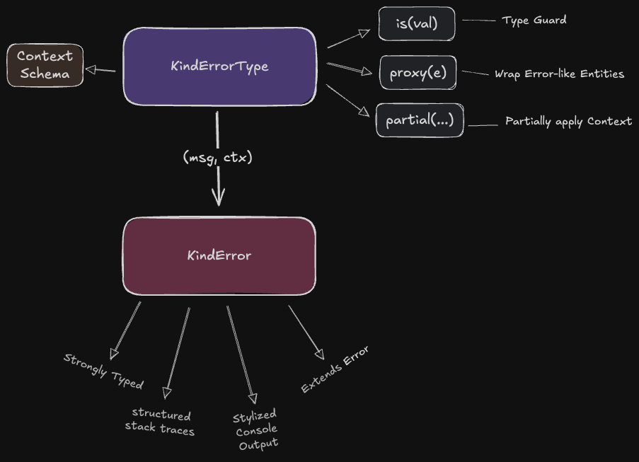
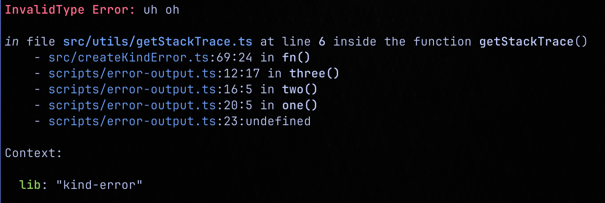

# Kind Error

> A better error primitive for Javascript/Typescript.



## Install

```sh
pnpm add @yankeeinlondon/kind-error
```

<details>

<summary>
Alternatives
</summary>
<br/>

| <span style="font-weight: 200">Manager</span>| <span style="font-weight: 200">Shell Command</span> |
| --- | --- |
| **npm** | npm install @yankeeinlondon/kind-error  |
| **yarn** | yarn add @yankeeinlondon/kind-error | 
| **bun** | bun add @yankeeinlondon/kind-error | 

</details>

## Basic Usage

1. Create an Error _type_ with first call to `createKindError`:

   ```ts
   const InvalidRequest = createKindError("invalid-request", { lib: "foobar", url: "string" });
   ```

   The error type `InvalidRequest` has now been created as a `KindErrorType`:

   - it acts as a function which will produce an error with the following properties:
       - `name` - the _name_ is the PascalCase version of what you called it (e.g., `InvalidRequest`)
       - `kind` - the _kind_ is the kebab-cased version of what you called it (e.g., `invalid-request`)
       - `type` - the _type_ is the _kind_ string up to but not including a `/` character
       - `subType` - the _subType_ is the _kind_ string after the first `/` character:
         - if there is no `/` character in the `kind` then subType is _undefined_
         - you may provide a union type for the subType by using the `|` character:
           - `invalid-request/get | post | put | delete` 
           - will make the **subType** `"get" | "post" | "put" | "delete"`
           - when you express the subtype as a union type, this will change the signature of calling this type:
             - The default calling signature is `ErrorType(message, props)` (where `props` is potentially optional if there are no required props in the )
       - `stackTrace` - a structured stack trace
       - **context**
         - any properties passed into the second parameter help define the _shape_ of the error
         - In our example the `lib` and `url` properties have been set:
           - because `lib` is a non-union string literal it is a fixed property and error created will always have a static property of `lib` that equals `foobar`.
           - because `url` is both _required_ and a _wide_ type that means that calling the function will **require** that the `url` property be included!


2. Creating an Error from an Error Type:

     ```ts
     throw InvalidRequest("oh no!"); // invalid
     ```

    Because we defined `url` as required but gave it a _variant_ type, the syntax above will throw a typescript error and not compile. This mechanism is powerful as it enforces that required properties (which are _variant_ in value) must be included when producing the error.

     ```ts
     throw InvalidRequest("oh no!", { url: "https://google.com" }); // valid
     ```

    Now we've addressed the `url` constraint and the error will be produced without any issue.

    ```ts
    throw InvalidRequest("oh no!", { url: "https://google.com", color: "red" }); // invalid
    ```

    By default a `KindErrorType` is _strict_ about the properties it allows for. This means that if you want to add a `color` property you'd have to have included it in the schema for the type. You can, however, add optional parameters to a type so that `color` is not required but _can_ be included if so desired.


## Partial Application

The ability to define an error type with a context schema of key/value pairs to be -- in part -- filled in later when the error is actually being raised is handy because often the details we need to complete an error are only available later. However, to increase flexibility and encourage consistency we must also recognize that sometimes the context we need to report fully on an error is built up in stages over time. This is where the power of _partial application_ comes from.

Let's demonstrate this with an example:

1. Let's define an error type which immediately sets the `lib` property but then defines two additional required properties `section` and `url`:

    ```ts
    const InvalidRequest = createKindError("invalid-request", { 
        lib: "kind-error", // static property
        section: "one|two|three", // an enumerated set of section choices
        url: "string" // any string value
    });
    ```

2. In our code base we may move into a part of the code where we _know_ the `section` we're in but the `url` is still going to be determined later:

    ```ts
    const Err = InvalidRequest.partial({ section: "one" });
    ```

3. Now when we actually want to raise an error we are only presented with the one remaining required property in the context schema `url`: 

    ```ts
    throw Err("This is the error message", { url });
    ```

In our example we chose to partially apply a _required_ property of the schema but this will work equally as well with an optional property in the schema too. 

> Note: at any point when a partial application is done, the key/values applied become a static/readonly part of the context dictionary and future callers will only be required (and able) to modify the key/values which remain as undefined.

## Error Proxy

Once you get used to having `KindError`'s there's no going back ... says an entirely unbiased person. But in all seriousness, once you get get used to the strong typing, schema structuring and everything else you find yourself wishing all errors were `KindError`s. Well they can be ... in part due to the built-in "proxy" functionality of the `KindErrorType`.

In the code below we show a standard try/catch block use-case where you might find using the proxy functionality useful:

```ts
const Unexpected = createKindError("unexpected");

try {
    // do something dangerous (but exciting)
} catch(e) {
    // Crime never pays, of course you got an error!
    // Hey it's not typed! Should you assume it's supposed to be an `Error`?
    // Who cares, just proxy it.
    throw UnexpectedOutcome.proxy(e, "just in case");
}
```

Regardless of the underlying shape of `e`, the proxy function will evaluate it and apply the following logic:

- if `e` turns out to be a `KindError` then the error will be proxied through "as is" (why mess with perfection)
- if `e` is just some plain jane `Error` type then extract the "message" and use it in a `Unexpected` kind error but add an `underlying` property which contains the base error.
- if `e` is a fetch network response then we'll add both the `underlying` property _and_ a `code` property which proxies through the HTTP code returned.
- if `e` is a POJO (_plain old javascript object_) then we'll look for a "message" property and use that for the wrapped kind error's message along with of course adding the `underlying` property.
- if `e` is a string then we'll use that as the kind error's message; no `underlying` property needed.
- in all other cases we'll add in the kind error's name in _prose_ format: `SomethingBadHappened` kind error will be have a message of "Something bad happened".
  - If the user provided a _fallback_ message -- in our example we used `just in case` -- then we'll use that instead

## Type Guards

Type guards are an important part of any good Typescript code. They help us _narrow_ the type at runtime and align the runtime values with the type system so that you can have the strongest benefit of the type system at design time.

This library provides several type guards which you can use to help on your next project.

### Detecting Errors

1. `isOk(val)` _- tests whether value is any recognized form of `Error` or `RequestFailure` and if it is not excludes these error types from val's type._
2. `isError(val)` _- tests whether `val` is any recognized form of an `Error` or `RequestFailure` and isolates the type of val to only these types._
3. `isKindError(val, [kind])`  _- this type guard will establish whether the variable `val` is a valid `KindError` or not. You can also optionally specify a particular 'kind' you want to look for._
4. `KindErrorType.is(val)` - _every `KindErrorType` error type comes with a `is(val)` type guard built in._

### Used in Error Proxy

We also expose some type guards which we internally use as part of the **proxy** functionality but you may find use for this too (and hey, _sharing is caring_):

1. `isFetchResponse(val)`
2. `isFetchError(val)`
3. `isStringifyable(val)`

## Structured Callstack and Pretty Print

The two major entity types defined in this repo are `KindErrorType` (a error type) and `KindError` (an error) and both come with built-in `toString()` functions which produce nice looking console output when converted to a string. WIth the `KindError` this output is aided by a structured call stack which is parsed from Javascript's string `stack` property and provided (if you want direct access) to the `stackTrace` property on kind errors.

As an example, when you have something like the following code: `console.log(InvalidType)`, you'll get something resembling this in your console:



